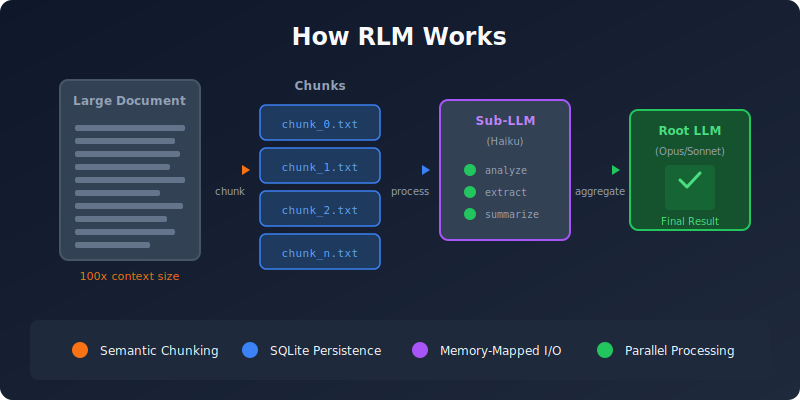

# rlm-rs

[](https://github.com/zircote/rlm-rs/actions/workflows/ci.yml)
[](https://www.rust-lang.org/)
[](LICENSE)

Recursive Language Model (RLM) CLI for Claude Code - handles long-context tasks via chunking and recursive sub-LLM calls.

Based on the RLM pattern from [arXiv:2512.24601](https://arxiv.org/abs/2512.24601), enabling analysis of documents up to 100x larger than typical context windows.

## Features

- **Hybrid Semantic Search**: Combined semantic + BM25 search with RRF fusion
- **Auto-Embedding**: Embeddings generated automatically during load
- **Pass-by-Reference**: Retrieve chunks by ID for efficient subagent processing
- **Multiple Chunking Strategies**: Fixed, semantic, and parallel chunking
- **SQLite State Persistence**: Reliable buffer management across sessions
- **Regex Search**: Fast content search with context windows
- **Memory-Mapped I/O**: Efficient handling of large files
- **JSON Output**: Machine-readable output for integration

## How It Works

<p align="center">
  
</p>

## Installation

### Via Cargo (Recommended)

```bash
cargo install rlm-rs
```

### Via Homebrew

```bash
brew tap zircote/tap
brew install rlm-rs
```

### From Source

```bash
git clone https://github.com/zircote/rlm-rs.git
cd rlm-rs
make install
```

## Quick Start

```bash
# Initialize the database
rlm-rs init

# Load a large document (auto-generates embeddings)
rlm-rs load document.md --name docs --chunker semantic

# Search with hybrid semantic + BM25
rlm-rs search "your query" --buffer docs --top-k 10

# Retrieve chunk by ID (pass-by-reference)
rlm-rs chunk get 42

# Check status
rlm-rs status

# Regex search content
rlm-rs grep docs "pattern" --max-matches 20

# View content slice
rlm-rs peek docs --start 0 --end 3000
```

## Commands

| Command | Description |
|---------|-------------|
| `init` | Initialize the RLM database |
| `status` | Show current state (buffers, chunks, DB info) |
| `load` | Load a file into a buffer with chunking (auto-embeds) |
| `search` | Hybrid semantic + BM25 search across chunks |
| `chunk get` | Retrieve chunk by ID (pass-by-reference) |
| `chunk list` | List chunks for a buffer |
| `chunk embed` | Generate embeddings (or re-embed with --force) |
| `chunk status` | Show embedding status |
| `list` | List all buffers |
| `show` | Show buffer details |
| `delete` | Delete a buffer |
| `peek` | View a slice of buffer content |
| `grep` | Search buffer content with regex |
| `write-chunks` | Write chunks to individual files |
| `add-buffer` | Add text to a new buffer |
| `export-buffers` | Export all buffers to JSON |
| `var` | Get/set context variables |
| `global` | Get/set global variables |
| `reset` | Delete all RLM state |

## Chunking Strategies

| Strategy | Best For | Description |
|----------|----------|-------------|
| `semantic` | Markdown, code, JSON | Splits at natural boundaries (headings, paragraphs) |
| `fixed` | Logs, plain text | Splits at exact byte boundaries |
| `parallel` | Large files (>10MB) | Multi-threaded fixed chunking |

```bash
# Semantic chunking (default)
rlm-rs load doc.md --chunker semantic

# Fixed chunking with overlap
rlm-rs load logs.txt --chunker fixed --chunk-size 150000 --overlap 1000

# Parallel chunking for speed
rlm-rs load huge.txt --chunker parallel --chunk-size 100000
```

## Claude Code Integration

rlm-rs is designed to work with the [rlm-rs Claude Code plugin](https://github.com/zircote/rlm-plugin), implementing the RLM architecture:

| RLM Concept | Implementation |
|-------------|----------------|
| Root LLM | Main Claude Code conversation (Opus/Sonnet) |
| Sub-LLM | `rlm-subcall` agent (Haiku) |
| External Environment | `rlm-rs` CLI + SQLite |

## Development

### Prerequisites

- Rust 1.88+ (2024 edition)
- [cargo-deny](https://github.com/EmbarkStudios/cargo-deny) for supply chain security

### Build

```bash
# Using Makefile
make build          # Debug build
make release        # Release build
make test           # Run tests
make check          # Format + lint + test
make ci             # Full CI check
make install        # Install to ~/.cargo/bin

# Or using Cargo directly
cargo build --release
cargo test
cargo clippy --all-targets --all-features
```

### Project Structure

```
src/
├── lib.rs           # Library entry point
├── main.rs          # CLI entry point
├── error.rs         # Error types
├── core/            # Core types (Buffer, Chunk, Variable)
├── chunking/        # Chunking strategies
├── storage/         # SQLite persistence
├── io/              # File I/O with mmap
└── cli/             # Command implementations

tests/
└── integration_test.rs
```

## MSRV Policy

The Minimum Supported Rust Version (MSRV) is **1.88**.

## License

MIT License - see [LICENSE](LICENSE) for details.

## Documentation

- [RLM-Inspired Design](docs/rlm-inspired-design.md) - How rlm-rs builds on the RLM paper
- [Plugin Integration](docs/plugin-integration.md) - Integration with Claude Code, Copilot, Codex, and more
- [Architecture](docs/architecture.md) - Internal architecture and design
- [CLI Reference](docs/cli-reference.md) - Complete command documentation
- [API Reference](docs/api.md) - Rust library documentation

## Acknowledgments

- [claude_code_RLM](https://github.com/brainqub3/claude_code_RLM) - Original Python RLM implementation by [Brainqub3](https://brainqub3.com/) that inspired the creation of this project
- [RLM Paper (arXiv:2512.24601)](https://arxiv.org/abs/2512.24601) - Recursive Language Model pattern by Zhang, Kraska, and Khattab (MIT CSAIL)
- [Claude Code](https://claude.ai/code) - AI-powered development environment
