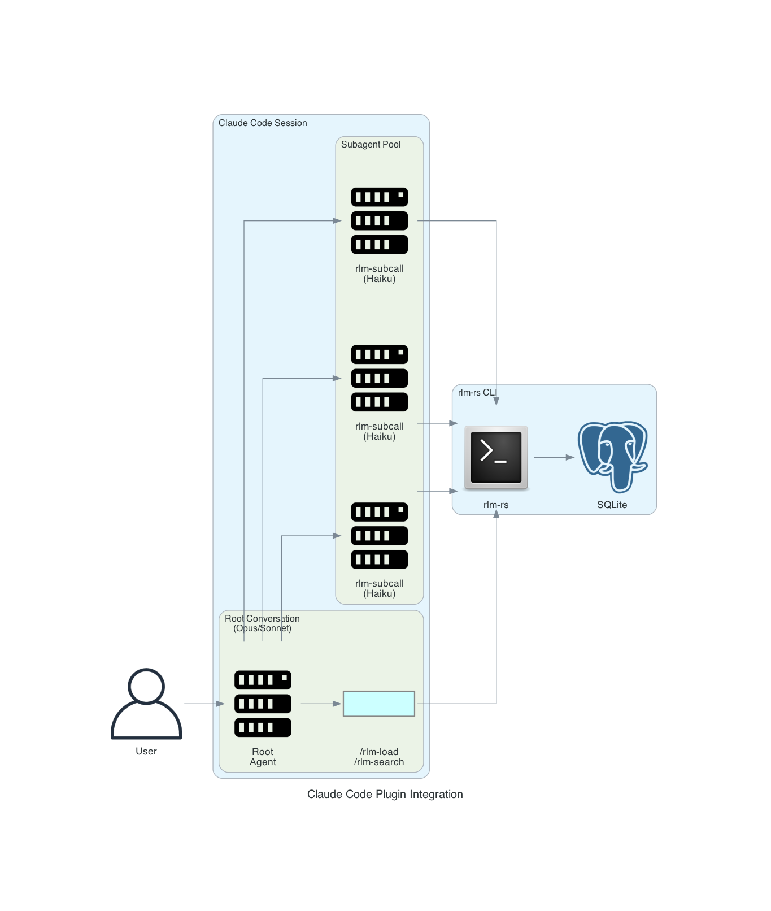
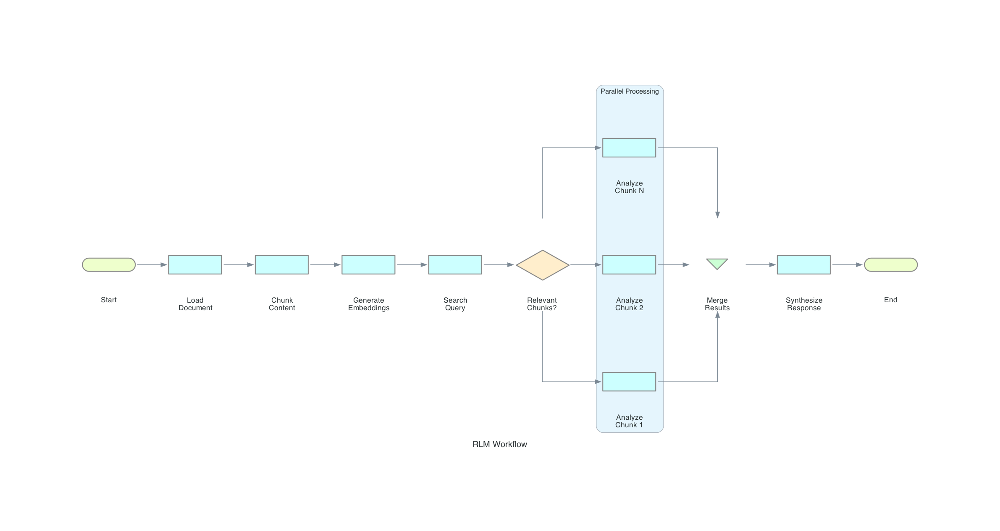

# Plugin Integration Guide

This guide explains how to integrate rlm-rs with AI coding assistants through plugins, skills, and commands. While the examples focus on Claude Code, the patterns apply to any AI assistant that can execute shell commands.

## Overview

rlm-rs is designed as a **CLI-first tool** that AI assistants invoke via shell execution. This architecture enables:

- **Universal Compatibility**: Any assistant with shell access can use rlm-rs
- **No Custom APIs**: Standard stdin/stdout/stderr communication
- **JSON Output**: Machine-readable format for programmatic integration
- **Stateless Commands**: Each invocation is independent (state lives in SQLite)

---

## Claude Code Integration

### Plugin Architecture

The [rlm-rs Claude Code plugin](https://github.com/zircote/rlm-plugin) implements the RLM pattern:



### Components

#### 1. Slash Commands (Skills)

User-invocable shortcuts for common operations:

| Command | Description | Maps To |
|---------|-------------|---------|
| `/rlm-load` | Load file into RLM | `rlm-rs load <file>` |
| `/rlm-search` | Search loaded content | `rlm-rs search <query>` |
| `/rlm-status` | Show RLM state | `rlm-rs status` |
| `/rlm-analyze` | Full RLM analysis workflow | Orchestrated multi-step |

**Example Skill Definition** (`.claude/skills/rlm-load.md`):

```markdown
---
name: rlm-load
description: Load a file or directory into RLM for analysis
arguments:
  - name: path
    description: File or directory to load
    required: true
  - name: name
    description: Buffer name (defaults to filename)
    required: false
---

Load content into RLM for semantic search and chunk-based analysis.

## Workflow

1. Check if rlm-rs is installed: `which rlm-rs`
2. Initialize if needed: `rlm-rs init`
3. Load the content: `rlm-rs load {{path}} --name {{name}} --chunker semantic`
4. Report status: `rlm-rs status --format json`

## Output

Report the number of chunks created and confirm embeddings were generated.
```

#### 2. Subagents

Specialized agents for chunk-level processing:

**rlm-subcall Agent** (`.claude/agents/rlm-subcall.md`):

```markdown
---
name: rlm-subcall
model: haiku
description: Efficient chunk-level analysis for RLM workflow
tools:
  - Bash
  - Read
---

You are a focused analysis agent processing individual chunks from large documents.

## Instructions

1. Retrieve the chunk: `rlm-rs chunk get <chunk_id>`
2. Analyze according to the prompt
3. Return structured JSON findings:

```json
{
  "chunk_id": <id>,
  "findings": [...],
  "relevance": "high|medium|low",
  "summary": "Brief summary"
}
```

Keep responses concise. You're part of a larger workflow.
```

**rlm-synthesizer Agent** (`.claude/agents/rlm-synthesizer.md`):

```markdown
---
name: rlm-synthesizer
model: sonnet
description: Synthesize findings from multiple chunk analyses
tools:
  - Read
  - Bash
---

You aggregate results from multiple rlm-subcall analyses.

## Instructions

1. Review all chunk findings
2. Identify patterns and connections
3. Synthesize into coherent narrative
4. Highlight key insights and recommendations
```

#### 3. Hooks

Automated triggers for RLM operations:

**Auto-load on large files** (`.claude/hooks/large-file-rlm.md`):

```markdown
---
event: PostToolUse
tool: Read
---

If the file read was larger than 50KB, suggest loading it into RLM:

"This is a large file. Consider using `/rlm-load {{file_path}}` for semantic search."
```

### Typical Workflow



---

## Portable Integration Patterns

### Generic CLI Integration

Any AI assistant can integrate with rlm-rs using these patterns:

#### Pattern 1: Search-Then-Retrieve

```bash
# 1. Load content (one-time setup)
rlm-rs load large-document.md --name docs

# 2. Search for relevant chunks
RESULTS=$(rlm-rs --format json search "your query" --top-k 5)

# 3. Extract chunk IDs
CHUNK_IDS=$(echo "$RESULTS" | jq -r '.results[].chunk_id')

# 4. Retrieve and process each chunk
for ID in $CHUNK_IDS; do
    CONTENT=$(rlm-rs chunk get $ID)
    # Process $CONTENT...
done
```

#### Pattern 2: Grep-Based Analysis

```bash
# Find specific patterns
rlm-rs grep docs "TODO|FIXME|HACK" --format json --max-matches 50

# Get context around matches
rlm-rs grep docs "error.*handling" --window 200
```

#### Pattern 3: Progressive Refinement

```bash
# Broad search first
rlm-rs search "authentication" --top-k 20

# Narrow down
rlm-rs search "JWT token validation" --top-k 5 --mode semantic

# Exact match
rlm-rs search "validateToken function" --mode bm25
```

### JSON Output Schema

All commands with `--format json` return structured data:

**Search Results**:
```json
{
  "count": 3,
  "mode": "hybrid",
  "query": "authentication",
  "results": [
    {
      "chunk_id": 42,
      "buffer_id": 1,
      "buffer_name": "auth.rs",
      "score": 0.0328,
      "semantic_score": 0.0499,
      "bm25_score": 0.0000016
    }
  ]
}
```

**Status**:
```json
{
  "initialized": true,
  "db_path": ".rlm/rlm-state.db",
  "db_size_bytes": 245760,
  "buffer_count": 3,
  "chunk_count": 42,
  "total_content_bytes": 125000,
  "embeddings_count": 42
}
```

**Chunk**:
```json
{
  "id": 42,
  "buffer_id": 1,
  "buffer_name": "auth.rs",
  "index": 3,
  "byte_range": [12000, 15000],
  "size": 3000,
  "content": "...",
  "has_embedding": true
}
```

---

## Platform-Specific Notes

### GitHub Copilot

Copilot can invoke rlm-rs through its terminal integration:

```
@terminal rlm-rs load src/ --name code
@terminal rlm-rs search "error handling"
```

### Codex CLI

Codex can execute rlm-rs commands directly:

```bash
codex "Load the documentation and find sections about API authentication"
# Codex runs: rlm-rs load docs/ && rlm-rs search "API authentication"
```

### OpenCode / Aider

These tools can use rlm-rs as an external helper:

```bash
# In .aider.conf.yml or similar
tools:
  - name: rlm-search
    command: rlm-rs --format json search "$QUERY"
```

### VS Code Extensions

Extensions should use `execFile` instead of `exec` for security (avoids shell injection):

```typescript
import { execFile } from 'child_process';
import { promisify } from 'util';

const execFileAsync = promisify(execFile);

interface SearchResult {
    chunk_id: number;
    score: number;
}

interface SearchResponse {
    results: SearchResult[];
}

async function searchRLM(query: string): Promise<SearchResult[]> {
    // Using execFile (not exec) prevents shell injection
    const { stdout } = await execFileAsync('rlm-rs', [
        '--format', 'json',
        'search', query
    ]);
    const response: SearchResponse = JSON.parse(stdout);
    return response.results;
}
```

---

## Best Practices

### 1. Use Semantic Chunking for Code

```bash
rlm-rs load src/ --chunker semantic --chunk-size 3000
```

Semantic chunking respects function and class boundaries.

### 2. Name Buffers Meaningfully

```bash
rlm-rs load src/auth/ --name auth-module
rlm-rs load src/api/ --name api-handlers
rlm-rs load docs/ --name documentation
```

This makes search results more interpretable.

### 3. Use Hybrid Search by Default

```bash
rlm-rs search "query" --mode hybrid
```

Hybrid combines semantic understanding with keyword matching.

### 4. Batch Subagent Calls

Instead of sequential calls, use parallel Task invocations:

```
# Good: Parallel
Task(rlm-subcall, chunk 12) || Task(rlm-subcall, chunk 27) || Task(rlm-subcall, chunk 33)

# Avoid: Sequential
Task(rlm-subcall, chunk 12)
Task(rlm-subcall, chunk 27)
Task(rlm-subcall, chunk 33)
```

### 5. Store Intermediate Results

```bash
# After subcall analysis
rlm-rs add-buffer auth-analysis "$(cat subcall-results.json)"

# Later retrieval
rlm-rs show auth-analysis
```

---

## Troubleshooting

### Command Not Found

```bash
# Check installation
which rlm-rs

# Install if missing
cargo install rlm-rs
# or
brew install zircote/tap/rlm-rs
```

### Database Not Initialized

```bash
rlm-rs init
```

### No Search Results

1. Check if content is loaded: `rlm-rs list`
2. Verify embeddings exist: `rlm-rs chunk status`
3. Try broader query or lower threshold: `--threshold 0.1`

### JSON Parsing Errors

Ensure you're using `--format json`:

```bash
rlm-rs --format json search "query"  # Correct
rlm-rs search "query" --format json  # Also correct
```

---

## See Also

- [RLM-Inspired Design](rlm-inspired-design.md) - Architectural philosophy
- [CLI Reference](cli-reference.md) - Complete command documentation
- [Architecture](architecture.md) - Internal implementation details
