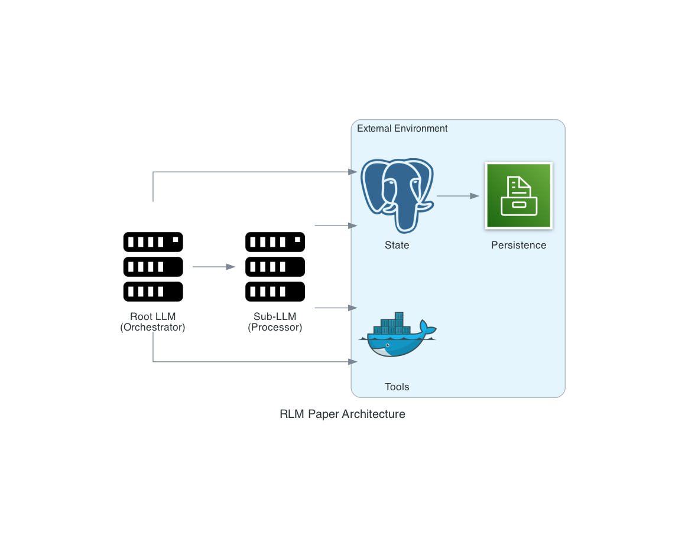
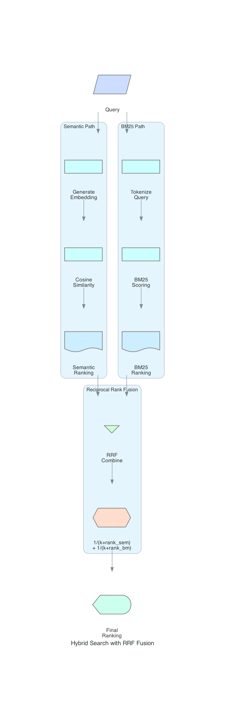
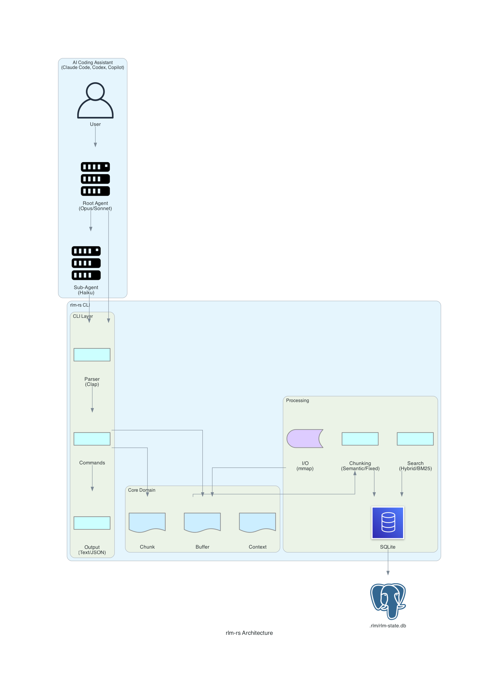

# RLM-Inspired Design: Extending the Recursive Language Model Pattern

This document outlines how **rlm-rs** builds upon the Recursive Language Model (RLM) research paper while extending it for practical use in AI-assisted software development.

## The RLM Foundation

### Original Research

The Recursive Language Model (RLM) pattern, introduced in [arXiv:2512.24601](https://arxiv.org/abs/2512.24601) by Zhang, Kraska, and Khattab (MIT CSAIL), addresses a fundamental limitation of large language models: **fixed context windows**.

**Core Insight**: Rather than trying to fit everything into a single context window, decompose large tasks into smaller subtasks processed by sub-LLMs, with a root LLM orchestrating the overall workflow.



### Key RLM Principles

1. **Hierarchical Decomposition**: Break large documents into manageable chunks
2. **Recursive Processing**: Sub-LLMs process chunks independently
3. **State Externalization**: Persist intermediate results outside the LLM context
4. **Result Aggregation**: Synthesize sub-results into coherent final output

---

## How rlm-rs Extends the Pattern

### Inspiration vs. Implementation

rlm-rs takes the RLM paper's theoretical foundation and translates it into a **practical CLI tool** optimized for AI-assisted coding workflows. Key extensions include:

| RLM Paper Concept | rlm-rs Implementation | Extension |
|-------------------|----------------------|-----------|
| Document chunking | Semantic, fixed, parallel strategies | Content-aware boundaries |
| State persistence | SQLite with transactions | Schema versioning, reliability |
| Sub-LLM invocation | Pass-by-reference via chunk IDs | Zero-copy retrieval |
| Result aggregation | Buffer storage for intermediate results | Named buffers, variables |
| Similarity search | Hybrid semantic + BM25 with RRF | Multi-signal ranking |

### Novel Contributions

#### 1. Pass-by-Reference Architecture

Instead of copying chunk content into prompts, rlm-rs uses **chunk IDs** that subagents can dereference:

```bash
# Root agent searches for relevant chunks
rlm-rs search "authentication errors" --format json | jq '.results[].chunk_id'
# Returns: 42, 17, 89

# Subagent retrieves specific chunk by ID
rlm-rs chunk get 42
# Returns: Full chunk content
```

**Benefits**:
- Reduces context usage in orchestration layer
- Enables parallel subagent processing
- Maintains single source of truth in SQLite

#### 2. Hybrid Search with Reciprocal Rank Fusion

The paper focuses on semantic similarity. rlm-rs combines multiple retrieval signals:



**Why RRF?** Semantic search excels at conceptual similarity; BM25 excels at exact keyword matching. Combining them handles both "what does this mean?" and "where is this term?" queries.

#### 3. Content-Aware Chunking

The paper treats chunking as a preprocessing step. rlm-rs makes it a first-class concern:

| Strategy | Algorithm | Best For |
|----------|-----------|----------|
| **Semantic** | Unicode sentence/paragraph boundaries | Markdown, code, prose |
| **Fixed** | Character boundaries with UTF-8 safety | Logs, raw text |
| **Parallel** | Rayon-parallelized fixed chunking | Large files (>10MB) |

```bash
# Semantic chunking preserves natural boundaries
rlm-rs load README.md --chunker semantic

# Fixed chunking for uniform sizes
rlm-rs load server.log --chunker fixed --chunk-size 50000

# Parallel chunking for speed on large files
rlm-rs load huge-dump.txt --chunker parallel
```

#### 4. Auto-Embedding on Load

Embeddings are generated automatically during document ingestion:

```bash
rlm-rs load document.md --name docs
# Output: Loaded document.md as 'docs' (15 chunks, embeddings generated)
```

This eliminates a separate embedding step and ensures search is always available.

---

## Architectural Layers



### Layer Responsibilities

| Layer | Purpose | Key Types |
|-------|---------|-----------|
| **CLI** | Parse args, dispatch commands, format output | `Cli`, `Commands`, `OutputFormat` |
| **Core** | Domain models with business logic | `Buffer`, `Chunk`, `Context` |
| **Chunking** | Split content into processable units | `Chunker` trait, strategies |
| **Search** | Find relevant chunks for queries | `SearchConfig`, RRF fusion |
| **Storage** | Persist state across sessions | `Storage` trait, SQLite |
| **I/O** | Efficient file operations | Memory-mapped reads, UTF-8 |

---

## Design Principles

### 1. CLI-First Interface

rlm-rs is designed as a **command-line tool** that any AI assistant can invoke via shell:

```bash
# Any AI assistant can run these commands
rlm-rs init
rlm-rs load document.md --name docs
rlm-rs search "error handling" --format json
rlm-rs chunk get 42
```

This means rlm-rs works with:
- Claude Code (via Bash tool)
- GitHub Copilot (via terminal)
- Codex CLI (via shell execution)
- OpenCode (via command execution)
- Any tool that can run shell commands

### 2. JSON Output for Integration

All commands support `--format json` for programmatic consumption:

```bash
rlm-rs --format json search "authentication" --top-k 5
```

```json
{
  "count": 3,
  "mode": "hybrid",
  "query": "authentication",
  "results": [
    {"chunk_id": 42, "score": 0.0328, "semantic_score": 0.0499, "bm25_score": 1.6e-6},
    {"chunk_id": 17, "score": 0.0323, "semantic_score": 0.0457, "bm25_score": 1.2e-6}
  ]
}
```

### 3. Zero External Dependencies at Runtime

rlm-rs is a **single static binary** with embedded:
- Embedding model (All-MiniLM-L6-v2 via fastembed)
- SQLite (via rusqlite)
- Full-text search (FTS5)

No Python, no external services, no API keys required.

### 4. Transactional Reliability

All state mutations use SQLite transactions:

```rust
// Pseudocode from storage layer
fn add_buffer(&mut self, buffer: &Buffer) -> Result<i64> {
    let tx = self.conn.transaction()?;
    // Insert buffer
    // Insert chunks
    // Generate embeddings
    tx.commit()?;  // All-or-nothing
    Ok(buffer_id)
}
```

---

## Comparison with Original RLM

| Aspect | RLM Paper | rlm-rs |
|--------|-----------|--------|
| **Primary Use Case** | General long-context tasks | Code analysis & development |
| **State Management** | Abstract "external environment" | Concrete SQLite database |
| **Retrieval** | Semantic similarity | Hybrid semantic + BM25 |
| **Chunking** | Fixed-size | Content-aware strategies |
| **Integration** | Research prototype | Production CLI tool |
| **Embedding** | External service | Embedded model (offline) |
| **Output** | Unspecified | Text + JSON formats |

---

## Why This Approach?

### Problem: Context Window Limits

Modern LLMs have context windows of 100K-200K tokens, but:
- Large codebases exceed this easily
- Full context = slower inference + higher cost
- Irrelevant context degrades response quality

### Solution: Intelligent Chunking + Retrieval

1. **Load once**: Chunk and embed documents upfront
2. **Search smart**: Find only relevant chunks for each query
3. **Process targeted**: Subagents work on specific chunks
4. **Synthesize**: Root agent combines results

### Result: 100x Effective Context

A 10MB codebase (~2.5M tokens) can be:
- Chunked into ~800 chunks of 3K chars each
- Searched to find top 10 relevant chunks
- Processed by subagents in parallel
- Synthesized into coherent analysis

---

## Future Directions

Building on the RLM foundation, planned extensions include:

1. **Streaming Processing**: Process chunks as they're generated
2. **Incremental Updates**: Re-embed only changed content
3. **Cross-Buffer Search**: Find patterns across multiple documents
4. **Agent Memory**: Persistent learning from previous analyses
5. **Distributed Processing**: Parallel subagent execution

---

## References

- Zhang, X., Kraska, T., & Khattab, O. (2025). *Recursive Language Models*. arXiv:2512.24601
- [claude_code_RLM](https://github.com/brainqub3/claude_code_RLM) - Python implementation that inspired this project
- [fastembed](https://github.com/qdrant/fastembed) - Rust embedding library
- [rusqlite](https://github.com/rusqlite/rusqlite) - SQLite bindings for Rust

---

## See Also

- [Architecture](architecture.md) - Internal implementation details
- [CLI Reference](cli-reference.md) - Complete command documentation
- [API Reference](api.md) - Rust library documentation
- [Plugin Integration](plugin-integration.md) - Claude Code plugin setup
